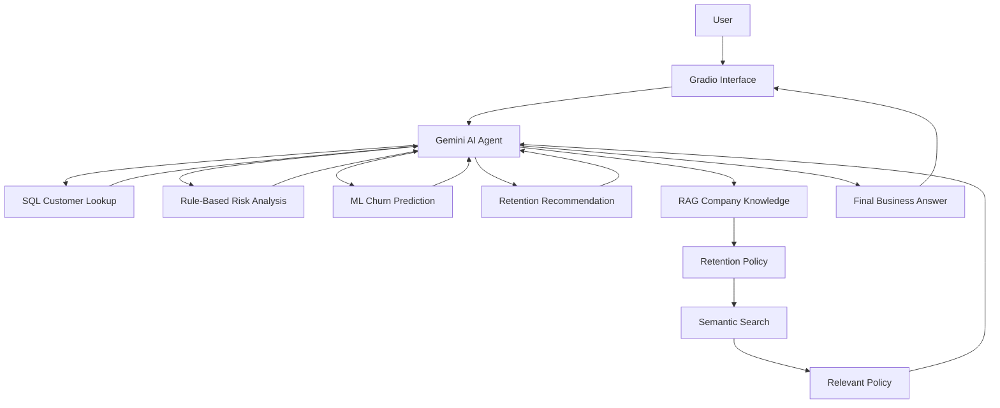

# Customer Retention AI Agent

An AI-powered telecom customer retention system that combines Machine Learning, SQL, rule-based risk analysis, Retrieval-Augmented Generation (RAG), and a Gemini-powered AI Agent.

## Overview

This project demonstrates how an AI Agent can use multiple specialized tools and knowledge sources to analyze telecom customers and support customer retention decisions.

The agent can:

* Retrieve customer information from a SQL database
* Calculate a rule-based churn risk score
* Predict churn probability using Machine Learning
* Generate a retention recommendation
* Retrieve relevant company policy information using RAG
* Combine the results into a clear business-oriented response

## System Architecture



## Key Features

### SQL Customer Lookup

Customer information is stored in a SQLite database.

The agent can retrieve structured customer information such as:

* Customer ID
* Contract type
* Tenure
* Monthly charges
* Total charges
* Internet and support services
* Historical churn status

### Rule-Based Risk Analysis

A transparent rule-based system calculates a customer risk score using predefined business rules.

Example factors include:

* Short customer tenure
* Month-to-month contract
* No technical support
* No online security

The result is classified as:

* Low Risk
* Medium Risk
* High Risk

This rule-based score is separate from the Machine Learning prediction.

### Machine Learning Churn Prediction

A Logistic Regression pipeline is used to estimate customer churn probability from historical telecom customer data.

The system provides:

* Churn probability
* ML prediction

The probability is treated as a model estimate and not as a guaranteed future outcome.

### Retention Recommendation

A recommendation tool suggests a retention action based on the customer's actual data.

Examples include:

* Offering a long-term contract
* Offering an online security package
* Offering a technical support package
* Offering a personalized retention package

### Retrieval-Augmented Generation (RAG)

The project includes a company retention policy knowledge base.

The RAG pipeline follows:

```text
Retention Policy
      ↓
Document Chunking
      ↓
Embeddings
      ↓
Semantic Search
      ↓
Relevant Policy
      ↓
Gemini AI Agent
      ↓
Grounded Response
```

RAG allows the agent to retrieve relevant company policy information when answering policy-related questions.

### AI Agent Orchestration

The Gemini-powered AI Agent determines which tool or tools are relevant to the user's request.

For example:

```text
User Question
      ↓
Gemini AI Agent
      ↓
┌──────────────┬──────────────┬──────────────┐
│ Customer Data│ Recommendation│ Company Policy│
│     SQL      │     Tool      │      RAG      │
└──────────────┴──────────────┴──────────────┘
      ↓
Final Business Answer
```

## Example Workflow

A user can ask:

> Based on this customer's data and the company retention policy, what retention action do you recommend and why?

The agent can combine:

* Customer data from SQL
* Retention recommendation
* Company policy retrieved through RAG

and provide a grounded business response.

## Technologies

* Python
* Google Gemini API
* Google Gen AI SDK
* Scikit-learn
* Logistic Regression
* SQLite
* Pandas
* NumPy
* Sentence Transformers
* Semantic Search
* Retrieval-Augmented Generation (RAG)
* Gradio
* Google Colab

## Interface

The project includes a Gradio interface with:

* Customer selection
* Quick analysis questions
* Customer comparison
* Free-form chat
* English and Arabic responses
* Conversation memory
* Conversation reset

## Project Structure

```text
customer-retention-ai-agent/
│
├── README.md
├── requirements.txt
├── .gitignore
└── screenshots/
```

Model files, databases, RAG indexes, secrets, and other local artifacts are intentionally excluded from the public repository.

## Why This Project

This project demonstrates the integration of:

```text
Structured Data
      +
Machine Learning
      +
Business Rules
      +
RAG
      +
LLM
      ↓
AI Agent
      ↓
Business-Oriented Response
```

The main goal is to demonstrate practical AI Agent orchestration using multiple tools and knowledge sources.

## Future Improvements

Possible improvements include:

* Expanding the company knowledge base
* Adding additional business policies
* Adding more predictive models
* Improving evaluation and monitoring
* Connecting the agent to external business APIs

## Project Status

Core system implemented with:

* SQL customer database
* Rule-based risk analysis
* Machine Learning churn prediction
* Retention recommendation
* Gemini AI Agent
* RAG knowledge retrieval
* Conversation memory
* Gradio interface
